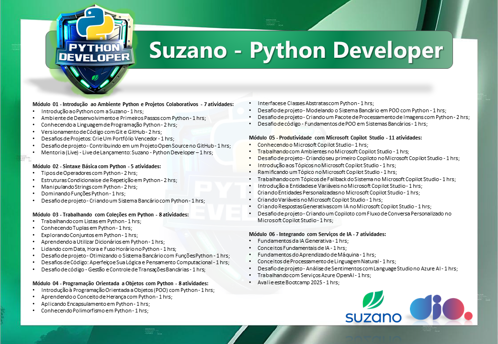

# Bootcamp Suzano - Python Developer

Bem-vindo ao repositório do Bootcamp Suzano - Python Developer oferecido pela DIO!

## 📚 Sobre o Bootcamp

Este bootcamp foi projetado para fornecer uma base sólida em desenvolvimento Python, cobrindo desde os conceitos básicos até tópicos mais avançados. Durante o curso, os participantes aprenderam a criar aplicações robustas e escaláveis, utilizando as melhores práticas da indústria.

## 📄 Conteúdo do Repositório

Neste repositório, você encontrará:

- **Contracapa do Curso**: Um PDF com a contracapa do curso, que pode ser baixado e anexado aos diplomas dos participantes que concluíram o bootcamp.
- **Desafios e Projetos**: Exemplos de código, desafios e projetos desenvolvidos durante o bootcamp.
- **Recursos Adicionais**: Links para documentação, tutoriais e outros recursos úteis para continuar aprendendo e aprimorando suas habilidades em Python.

## 📄 Desafios de Projeto

- **Desafio 01**: Criando seu primeiro Copiloto no Microsoft Copilot Studio
- **Desafio 02**: Criando um Copiloto com Fluxo de Conversa Personalizado no Microsoft Copilot Studio

## 📥 Download da Contracapa

Você pode baixar a contracapa do curso [aqui](./ContraCapa-SuzanoPythonDeveloper.pdf)
