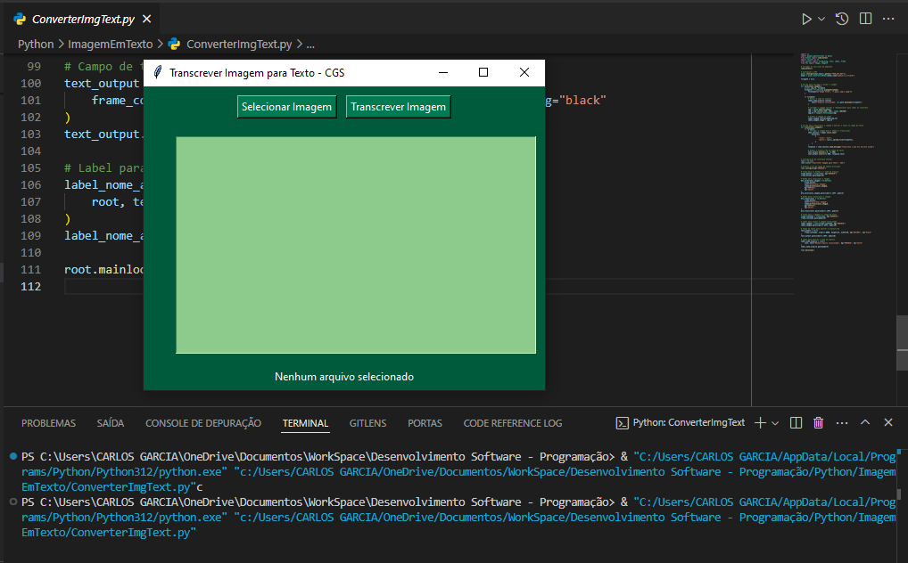
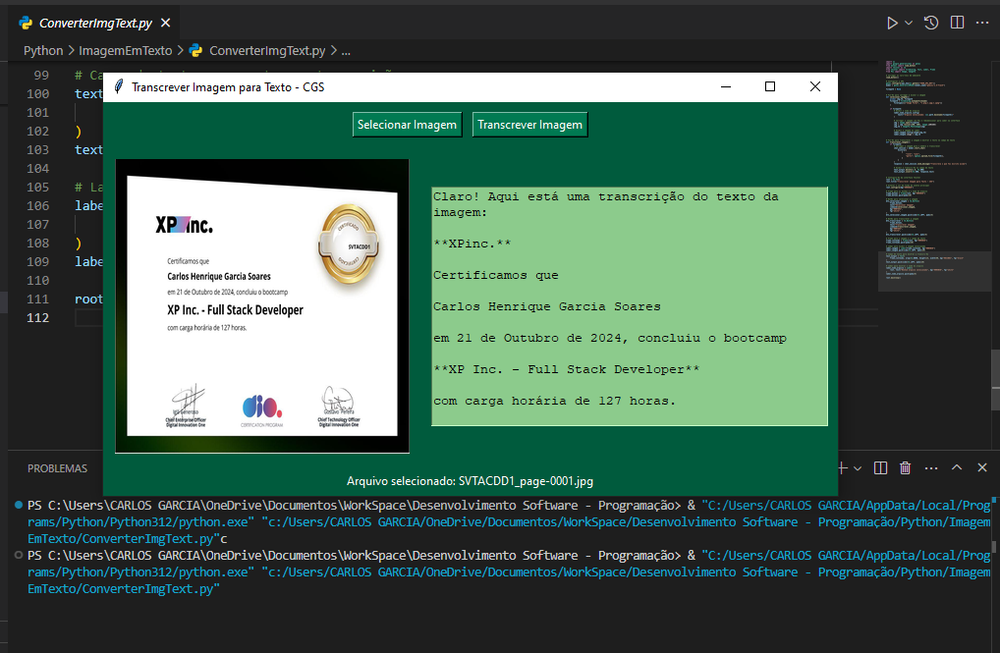

# Transcrever Imagem para Texto - CGS

Este projeto é uma aplicação Python que utiliza uma interface gráfica desenvolvida com Tkinter. Ele permite que o usuário selecione uma imagem, visualize-a e transcreva o conteúdo textual presente na imagem utilizando a API Google Generative AI.

## Funcionalidades

- **Seleção de Imagem**: Carregue arquivos de imagem nos formatos `.png`, `.jpg` ou `.jpeg`.
- **Exibição de Imagem**: A imagem carregada é redimensionada para caber na interface e exibida.
- **Transcrição de Texto**: O texto contido na imagem é processado e exibido em um campo de texto.
- **Interface Simples e Intuitiva**: Design responsivo com cores personalizadas.

## Tecnologias Utilizadas

- **Python**: Linguagem de programação principal.
- **Tkinter**: Para criação da interface gráfica.
- **Pillow (PIL)**: Para manipulação e exibição das imagens.
- **Google Generative AI**: Para processamento e transcrição do conteúdo da imagem.
- **dotenv**: Para gerenciamento seguro de variáveis de ambiente.

## Requisitos

- Python 3.9 ou superior.
- Uma chave de API válida para o Google Generative AI.

```
- Instalar as dependências listadas abaixo:
import os
import google.generativeai as genai
from dotenv import load_dotenv
import tkinter as tk
from tkinter import filedialog, Text, Label, Frame
from PIL import Image, ImageTk
```



