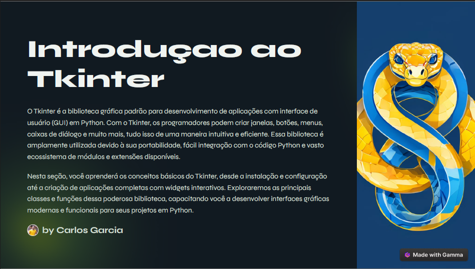

# Projeto Bootcamp DIO Python AI Backend Developer
# Ebook - Introdução ao Tkinter

## 📒 Descrição
Ebook totalmente eleaborado por Interligencia Artificial Generativa. 

## 🤖 Tecnologias Utilizadas
 - GammaApp para gerar o slide/Pdf;
 - ChatGpt para gerar os pormpts para alterar as imagens no GammaApp
 - ChatGpt para braisntorming de possíveis temas.

## 🧐 Processo de Criação
 - Inicie indo no ChatGopt e solicitar os temas mais quentes no que diz respoeito a programação com python autualmente;
  - Verifiqeui que um dos temas, é o que eu acabara de estudar na faculdade - a biblioteca tkinter;
  - Com isso, fui ao GammaApp e solicitei que gerasse um ebook sobre como usar a bilioteca Tkinter;
  - Utilizei o chatGot novamente para solicitar que elaborasse prompts mais acertuvos para alterar as imagens do GammaApp.

## 🚀 Resultados

Segue em anexo o pdf do ebook.

