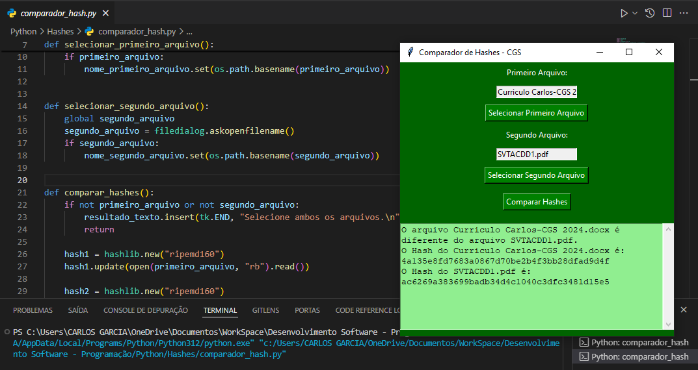

# Comparador de Hashes - CGS

Este projeto é uma interface gráfica simples criada em Python usando a biblioteca `Tkinter` para comparar os hashes de dois arquivos. Ele utiliza o algoritmo **RIPEMD-160** para gerar os hashes e exibe se os arquivos são iguais ou diferentes.

## Funcionalidades

- Seleção de dois arquivos para comparação.
- Geração de hashes dos arquivos utilizando o algoritmo **RIPEMD-160**.
- Comparação e exibição dos resultados dos hashes em uma interface gráfica.
- Verifica se os arquivos selecionados são idênticos ou diferentes.

## Bibliotecas Utilizadas

- `hashlib`: Para gerar os hashes.
- `os`: Para manipulação de nomes de arquivos e diretórios.
- `tkinter`: Para criar a interface gráfica.
- `tkinter.filedialog`: Para permitir que o usuário selecione arquivos no sistema.
- `tkinter.scrolledtext`: Para exibir os resultados da comparação de forma scrollable.

## Exemplo de uso

- Clique em Selecionar Primeiro Arquivo e escolha um arquivo no seu sistema.
- Clique em Selecionar Segundo Arquivo e escolha o segundo arquivo.
- Clique em Comparar Hashes .
- O programa exibirá se os arquivos são iguais ou diferentes, além de mostrar os hashes de cada arquivo.

## Algoritmo de Hash

O algoritmo utilizado para a geração dos hashes dos arquivos é o RIPEMD-160 , uma função hash criptográfica que gera uma string de 160 bits. É muito utilizado para garantir a integridade dos arquivos, garantindo que mesmo a menor alteração no conteúdo do arquivo gere um hash completamente diferente.

## Contribuições

Contribuições são bem-vindas! Se você deseja melhorar este projeto ou adicionar novas funcionalidades, fique à vontade para enviar um pull request.

