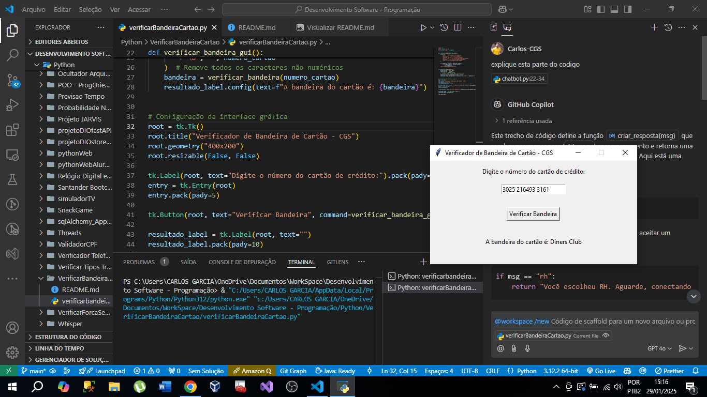

# Verificador de Bandeira de Cartão de Crédito - DIO

# Bootcamp Microsoft AI for Tech - GitHub Copilot

Este projeto é um aplicativo Python que verifica a bandeira de um cartão de crédito com base no número do cartão. A interface gráfica foi criada utilizando a biblioteca `tkinter`.

## Funcionalidades

- Verificação de bandeiras de cartão de crédito (Visa, MasterCard, American Express, Diners Club, Discover, JCB)
- Interface gráfica para entrada do número do cartão e exibição do resultado

## Como usar

1. Execute o script `verificarBandeiraCartao.py`.
2. Digite o número do cartão de crédito no campo de entrada.
3. Clique no botão "Verificar Bandeira".
4. A bandeira do cartão será exibida na própria janela do aplicativo.
5. Site para gerar cartões aleatórios: https://www.4devs.com.br/gerador_de_numero_cartao_credito

## Requisitos

- Python 3.x
- Biblioteca `tkinter` (geralmente incluída na instalação padrão do Python)

## Instalação

Clone este repositório e navegue até o diretório do projeto:

```bash
git clone <URL_DO_REPOSITORIO>
cd VerificarBandeiraCartao
```

Execute o script:

```bash
python verificarBandeiraCartao.py
```

## Sobre

Este código foi escrito utilizando o GitHub Copilot como proposta de desafio de projeto de um bootcamp da DIO (Digital Innovation One).


